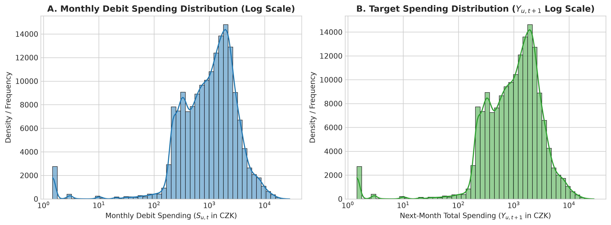
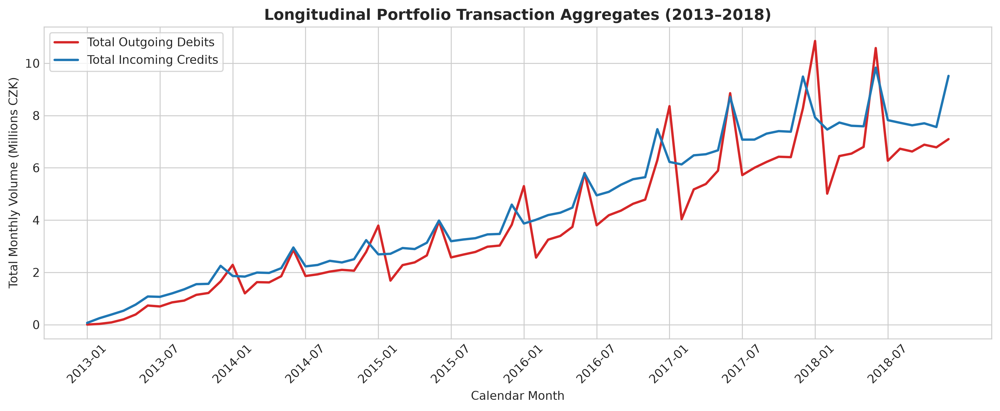
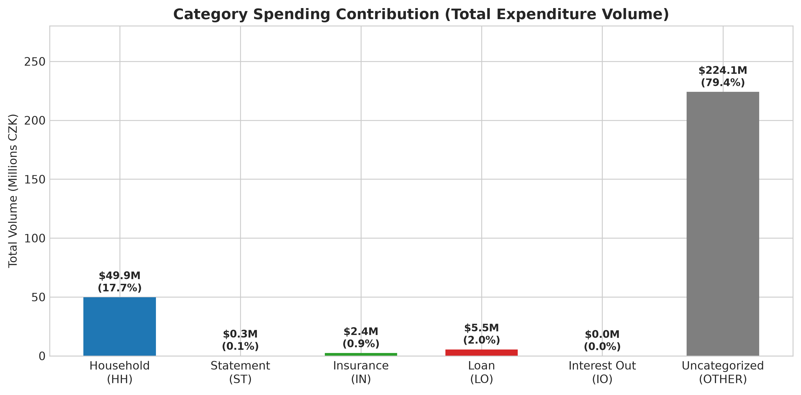
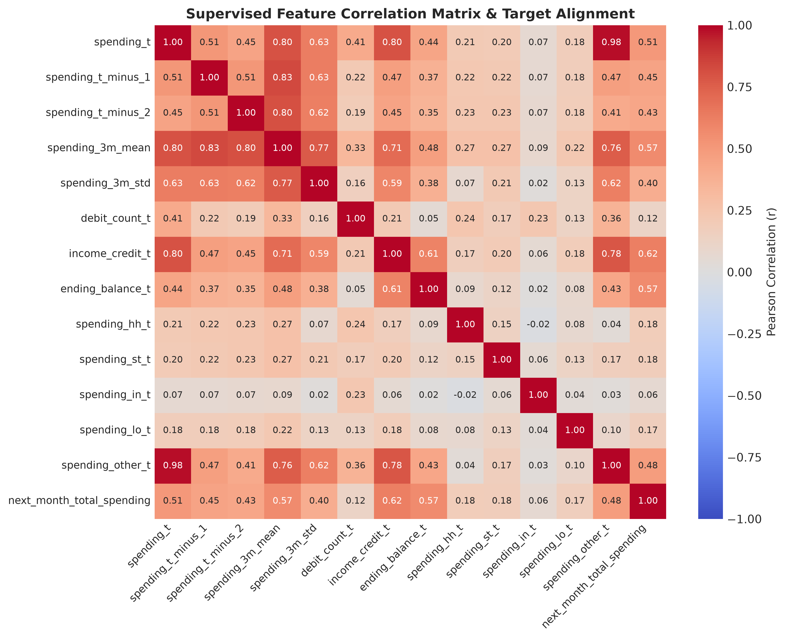
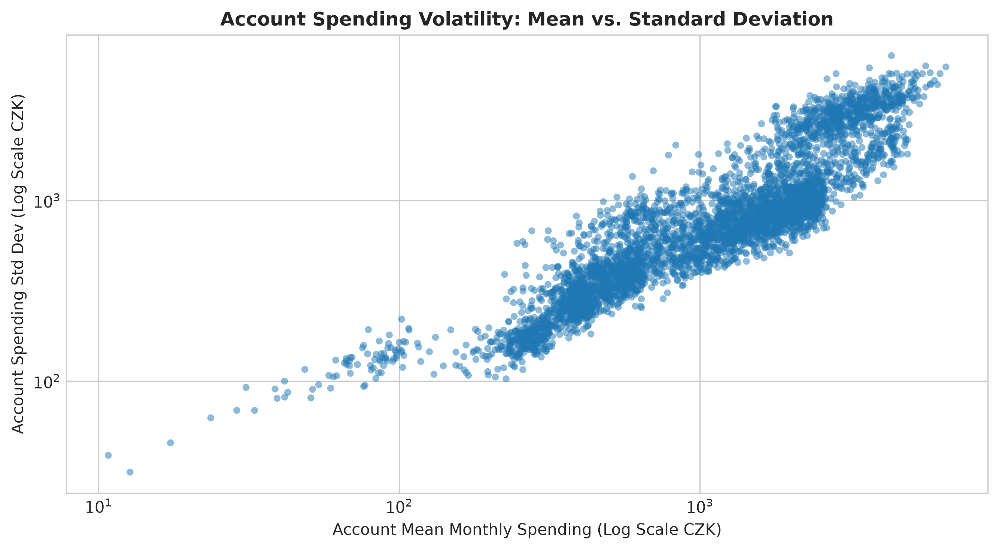

# Review 1 — Dimension 2: Data Preprocessing & Exploratory Data Analysis Report

**Project:** Personal Financial Digital Twin with Explainable Spending Forecasting  
**Date:** August 19, 2026  
**Status:** Review 1 — Dimension 2 Complete (Data Preprocessing, Leakage-Safe Feature Building, & Analytical EDA)  

---

## 1. Project Objective & Review Scope

The objective of **Review 1 — Dimension 2** is to convert raw, headerless financial transaction data into a validated monthly panel representation, construct a leakage-free supervised machine learning regression dataset, and perform empirical Exploratory Data Analysis (EDA) to establish baseline statistical properties.

**Core Machine Learning Target Formulation:**
Given account $u$'s historical financial behavior through calendar month $t$, predict its total outgoing debit expenditure during calendar month $t+1$:

$$Y_{u, t+1} = \sum_{k \in \text{Debits}_{u, t+1}} \text{Amount}_{u, k, \text{debit}}$$

> [!IMPORTANT]
> **Mandatory Temporal Rule:** All input features $X_{u, t}$ are constructed strictly using information available on or before the final day of reference month $t$. Zero information from month $t+1$ or later is used in feature construction.

---

## 2. Preprocessing & Engineering Methodology

### 2.1 Raw Data Ingestion & Immutability
- **Source Directory:** Preserved headerless raw TSVs located under [`data/raw/berka/`](file:///d:/College%20UG/3rd%20year/5TH%20SEM/Machine%20Learning/ML%20project/Personal%20Financial%20Digital%20Twin/data/raw/berka).
- **Immutability Guarantee:** All raw source files were treated as **100% read-only**. SHA-256 cryptographic hashes and byte sizes were audited before and after pipeline execution (0 files modified).
- **Headerless Loader:** Raw `.tsv` files were ingested using `pandas.read_csv(file, sep='\t', header=None, names=SCHEMAS[file])` to prevent losing the first transaction row.

### 2.2 Date Handling & Temporal Provenance
- Transaction dates were parsed into standard `datetime64[ns]` ISO strings (`YYYY-MM-DD`).
- **Date Shift Preservation:** The mirror's +20 year linear temporal shift (`2013-01-01` to `2018-12-31`) was preserved exactly as supplied. As documented in [`reports/date_provenance_check.md`](file:///d:/College%20UG/3rd%20year/5TH%20SEM/Machine%20Learning/ML%20project/Personal%20Financial%20Digital%20Twin/reports/date_provenance_check.md), this shift preserves 100% of relative time deltas, monthly sequences, and lag intervals.

### 2.3 Transaction Direction & Signed Amount Normalization
Empirical investigation of `fin_trans.tsv` established the signed amount convention:
- **Type `D` (Outgoing Debits):** 634,571 rows (634,561 negative values $\le 0$, 10 zero values, 0 positive values).
- **Type `C` (Incoming Credits):** 405,083 rows (405,079 positive values $\ge 0$, 4 zero values, 0 negative values).
- **Type `P` (Interest/Fee Adjustments):** 16,666 rows (16,666 negative values $\le 0$).

To represent outgoing spending as a positive monetary magnitude for supervised regression:
$$\text{spending\_debit}_{u, t} = \sum_{k \in \mathcal{D}_{u, t}} (-\text{Amount}_{u, k})$$

### 2.4 Month-End Balance Extraction ($B_{u, t}$)
To prevent target contamination, the monthly ending balance $B_{u, t}$ is calculated by sorting transaction records chronologically by `(account_id, date, trans_id)` and extracting the `balance` after the **final transaction of reference month $t$**.

### 2.5 Category Aggregation & Uncategorized Share
Debit transactions were aggregated into explicit category spending columns:
1. `spending_hh`: Household / Utility Payments (`HH`)
2. `spending_st`: Statement & Bank Service Fees (`ST`)
3. `spending_in`: Insurance Payments (`IN`)
4. `spending_lo`: Loan Repayments (`LO`)
5. `spending_io`: Interest Outward (`IO`)
6. `spending_other`: Uncategorized / General Debits (`''` / `NaN`)

$$\text{spending\_debit}_{u, t} = S_{u, t, \text{HH}} + S_{u, t, \text{ST}} + S_{u, t, \text{IN}} + S_{u, t, \text{LO}} + S_{u, t, \text{IO}} + S_{u, t, \text{OTHER}}$$

---

## 3. Supervised Dataset Construction ($X_{u, t} \to Y_{u, t+1}$)

A modular supervised feature builder ([`src/features/builder.py`](file:///d:/College%20UG/3rd%20year/5TH%20SEM/Machine%20Learning/ML%20project/Personal%20Financial%20Digital%20Twin/src/features/builder.py)) was executed against the monthly panel.

### 3.1 Historical Windowing & Continuity Rule
- **Historical Feature Window:** Months $t-2, t-1, t$ (3 consecutive months of history).
- **Target Window:** Month $t+1$ (1 month forward).
- **Continuity Condition:** Strict 4-consecutive calendar month requirement ($m_{t+1} - m_{t-2} = 3$). Zero samples span missing calendar months.

### 3.2 Feature Matrix Taxonomy ($X_{u, t}$)
1. `spending_t`: Spending in reference month $t$
2. `spending_t_minus_1`: Spending in month $t-1$
3. `spending_t_minus_2`: Spending in month $t-2$
4. `spending_3m_mean`: 3-Month Moving Average $\mu_{u, t} = \frac{S_t + S_{t-1} + S_{t-2}}{3}$
5. `spending_3m_std`: 3-Month Spending Volatility $\sigma_{u, t}$
6. `debit_count_t`: Debit transaction count in month $t$
7. `income_credit_t`: Credit deposit income in month $t$
8. `ending_balance_t`: Ending liquid balance at month $t$
9. Category features: `spending_hh_t`, `spending_st_t`, `spending_in_t`, `spending_lo_t`, `spending_io_t`, `spending_other_t`

---

## 4. Empirical Exploratory Data Analysis (EDA)

### 4.1 Panel & Supervised Sample Overview
- **Raw Transaction Rows:** `1,056,320` rows
- **Monthly Account Panel Rows:** `185,057` account-month observations across `4,500` accounts.
- **Supervised Regression Samples:** `171,194` samples across `4,500` accounts.
- **Temporal Span:** Reference months `2013-03` to `2018-11`; Target months `2013-04` to `2018-12`.
- **Missing Values:** `0` null values across all processed panel and supervised feature columns.

### 4.2 Spending & Target Distribution Statistics



* **Monthly Debit Spending ($S_{u, t}$):** Mean = **$1,524.78 CZK**, Std = **$1,817.66 CZK**, Median = **$1,006.20 CZK** (IQR: [$355.96, $2,044.89], Skewness = **3.19**).
* **Supervised Target ($Y_{u, t+1}$):** Mean = **$1,614.58 CZK**, Std = **$1,825.24 CZK**, Median = **$1,111.46 CZK** (Skewness = **3.18**).
* **Target Non-Negativity:** 100% of target values are non-negative ($Y_{u, t+1} \ge 0.00$). Zero targets are 3,549 (2.07%), representing months where accounts incurred zero debits.
* **Analytical Finding:** Spending follows a classic log-normal right-skewed distribution common in consumer banking data.

### 4.3 Longitudinal Portfolio Aggregate Trends



* Aggregate portfolio transaction volume expanded steadily from **2013 to 2017** as new accounts were opened by the bank, stabilizing through **2018**.
* Outgoing debit volume tracks incoming credit deposit volume closely across the 72-month period, demonstrating macro-level financial equilibrium.

### 4.4 Category Spending Breakdown



* **Household Payments (`HH`):** **$49,850,641.60 CZK** (17.67% of total spending, 118,065 debits).
* **Loan Repayments (`LO`):** **$5,525,230.33 CZK** (1.96% of total spending, 13,580 debits).
* **Insurance Payments (`IN`):** **$2,417,519.30 CZK** (0.86% of total spending, 18,500 debits).
* **Statement Fees (`ST`):** **$268,641.82 CZK** (0.10% of total spending, 155,832 debits).
* **Interest Outward (`IO`):** **$3,766.33 CZK** (0.001% of total spending, 1,577 debits).
* **Uncategorized Debits (`OTHER`):** **$224,105,938.40 CZK** (**79.42% of total spending**, 327,017 debits).
* **Critical Finding:** Over **79.42% of spending magnitude** consists of uncategorized general transfers and cash withdrawals (`OTHER`). This is an inherent property of the PKDD '99 dataset. Retaining `spending_other_t` as an explicit category ensures 100% mathematical reconciliation without losing general spending signals.

### 4.5 Multicollinearity & Feature Correlation Analysis



* **Top Predictors for Target $Y_{u, t+1}$:**
  1. `income_credit_t` ($r = +0.6204$) — Current income is the single strongest linear predictor of next-month spending capacity.
  2. `spending_3m_mean` ($r = +0.5696$) — 3-month moving average provides a highly stable baseline forecast.
  3. `ending_balance_t` ($r = +0.5669$) — Account ending balance reflects available liquid buffer.
  4. `spending_t` ($r = +0.5067$) — Recent lag-1 spending shows strong positive autocorrelation.
* **Multicollinearity:** High collinearity exists between `spending_3m_mean` and recent lags ($r > 0.85$), which is expected for rolling window features and will be handled via regularized linear models (Ridge/Lasso) and tree ensemble regressors during ML modeling.

### 4.6 Outlier Analysis & Account Volatility



* **Statistical Outlier Detection:**
  * **$1.5 \times \text{IQR}$ Upper Bound ($> \$4,578.28\text{ CZK}$): 9,517 monthly observations (5.14%).
  * **99th Percentile Bound ($> \$9,161.94\text{ CZK}$):** 1,851 monthly observations (1.00%).
* **Outlier Handling Decision:** **RETAINED WITHOUT ALTERATION.** These extreme spending values represent legitimate high-income/commercial account activities and major recurring loan disbursements. Deleting them would artificially restrict model generalizability to real-world banking clients.

---

## 5. Explicit Delineation of Project Findings

### A. Observed Empirical Facts
1. The raw dataset contains `1,056,320` transaction records across `4,500` accounts over 72 calendar months (`2013-01` to `2018-12`).
2. Raw debit transactions (`type == 'D'`) are formatted as negative values ($\le 0.00$).
3. Exactly **79.42% of spending volume** ($224.10\text{M CZK}$) is uncategorized (`k_symbol == ''`).
4. Constructing strictly consecutive 4-month calendar windows ($t-2, t-1, t \to t+1$) yields **`171,194` supervised samples** across all `4,500` accounts with 0 missing values.

### B. Methodological Decisions
1. **Magnitude Normalization:** Summing $-\text{Amount}$ for `type == 'D'` converts debits into positive expenditure values ($S_{u, t} \ge 0$).
2. **Ending Balance Extraction:** $B_{u, t}$ is taken strictly from the final transaction of month $t$ after chronological sorting by `(account_id, date, trans_id)`.
3. **Outlier Retention:** High spending outliers are retained to preserve real-world financial variance.
4. **Category Reconciliation:** Uncategorized spending is explicitly tracked via `spending_other_t`, preserving 100% spending reconciliation.

### C. Known Limitations
1. **Historical Currency Scale:** Monetary amounts are in 1990s CZK (shifted to 2010s dates). Relative spending ratios remain mathematically valid.
2. **Uncategorized Spending Dominance:** High proportion of uncategorized debits limits fine-grained merchant-level forecasting, requiring reliance on aggregate spending velocity and liquidity signals.

---

## 6. Reproducibility Commands

To execute the entire Dimension 2 pipeline from raw data to processed panel, supervised dataset, and EDA figures:

```powershell
# 1. Run raw dataset ingestion and monthly panel aggregation
python scripts/run_preprocessing.py

# 2. Build leakage-safe supervised feature dataset and run leakage audit
python scripts/build_supervised_dataset.py

# 3. Execute analytical EDA and generate publication-quality figures
python scripts/run_eda.py
```

---

## 7. Dimension 2 Summary Table

| Metric / Check | Value / Status |
| :--- | :--- |
| **Raw Transaction Rows** | `1,056,320` rows |
| **Monthly Panel Rows** | `185,057` account-months |
| **Supervised Dataset Rows** | **`171,194` samples** |
| **Unique Accounts** | `4,500` accounts (100% represented) |
| **Reference Month Span** | `2013-03` to `2018-11` |
| **Target Month Span** | `2013-04` to `2018-12` |
| **Debit Spending Reconciliation Delta** | **`$0.000000` (EXACT MATCH)** |
| **Category Reconciliation Delta** | **`$0.000000` (EXACT MATCH)** |
| **Data Leakage Audit** | **`PASSED` (0 target contamination)** |
| **Raw Data Immutability Check** | **`VERIFIED 100% IMMUTABLE`** |
| **ML Models Trained** | **`0` (Zero models trained)** |
